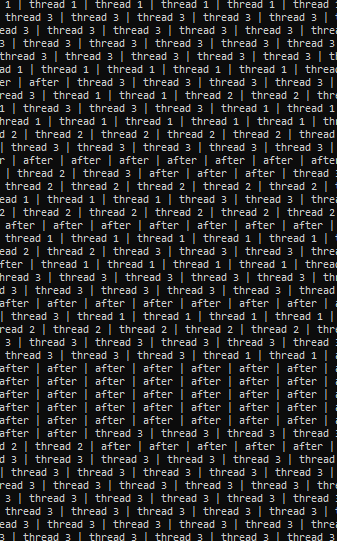
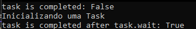
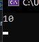
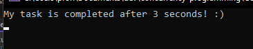

# Programação concorrente (C#)

### **O que é**

Geralmente, aplicações e programas performam mais de uma operação ao mesmo tempo, isso é chamado de concorrência.

### **Thread**

É um caminho de execução que pode ser executado de maneira de outras execuções. 

Por exemplo, no cálculo de uma expressão, apenas uma *Thread* pode ser utilizada, no entanto, caso seja necessário calcular outra situação ao mesmo momento, isso pode ser feito, através da utilização de outra *Thread*.

Na criação de uma Thread, ela pode ser criada e utilizada. Essa criação pode se dar com a utilização de outras Threads e elas serão executadas paralelamente.

Perceba, a execuções das Threads são realizadas no Program de maneira paralela e não necessariamente sequencial (aguardando a finalização de uma após a outra):



No entanto, esse comportamento pode ser alterado da seguinte maneira: 

Utilizando um variável que represente a Thread .Join() força que uma Thread execute, obrigatoriamente, após a outra.  

No Program 2, veja (uma Thread foi executada após a outra):


Caso seja necessário enviar algum parâmetro para os métodos, uma lambda expression pode ser utilizada:


### Tasks

Uma thread é utilizado para desenvolver, em baixo nível, a concorrência. Porém, existem algumas limitações: complicações para se obter retornos das funções e não é possível chamar uma thread para executar outra thread quando a primeira é finalizada.

Ao invés disso, é necessário utilizar o método **Join().** 

O gerenciamento das threads piora a performance da aplicação, para resolver isso a classe Task resolve algumas dessas questões.

Em resumo, um objeto de `Task` representa que você depende de uma operação pendente. 

Inicializando uma Task:

```csharp
Task.Run(() => Console.WriteLine("Inicializando uma Task"));
```

A equivalência:

```csharp
new Thread (() => Console.WriteLine ("Inicializando uma Task")).Start();
```

### Wait

O método Wait() é o equivalente ao Join() no gerenciamento direto de Threads. Você pode ver isso na execução da classe Program4. 



### Retorno de valores:

Ao contrário do gerenciamento direto de Threads; em Task, bem trivial. 

```csharp
class Program5
    {
        static void Main()
        {
            Task<int> task = Task.Run(() =>         
            {
                return 3;
            });

            int number = task.Result;

            Console.WriteLine(number);

            Console.ReadKey();
        }
    }
```


### Continuação

Continuações são operações que podem ser feitas após a finalização da Thread.

Essa continuação pode acontecer de duas maneiras:

utilizando o **Awaiter** (código integralmente do artigo):

```csharp
static void Main()
{
     Task<int> primeNumberTask = Task.Run(() =>
     {
          Thread.Sleep(3000);
          return 34;
     });
           
     var awaiter = primeNumberTask.GetAwaiter();
     awaiter.OnCompleted(() =>
     {
         int result = awaiter.GetResult();
         Console.WriteLine(result);
     });
 
     Console.ReadKey();
}
```

após 3 segundos:


já com o **ContinueWith** (código integralmente do artigo)**:**

```csharp
static void Main()
{
     Task<int> primeNumberTask = Task.Run(() =>
     {
          Thread.Sleep(3000);
          return 10;
     });
 
     primeNumberTask.ContinueWith(antecedent =>
     {
          int result = antecedent.Result;
          Console.WriteLine(result);
     });
 
     Console.ReadKey();
}
```

Após 3 segundos:




### **Delay**

O uso do Task.Delay() é asíncrono e equivale ao uso do **Thread.Sleep().**

```csharp
static void Main()
{
    Task.Delay(3000).GetAwaiter().OnCompleted(() => Console.WriteLine("My task is completed " +
        "after 3 seconds! :)"));
    Console.ReadKey();
}
```




**Disclaimer**: todo esse artigo foi baseado principalmente com informações obtidas [deste artigo.](https://medium.com/@sawomirkowalski/c-language-concurrency-multithreading-40103c82284)
